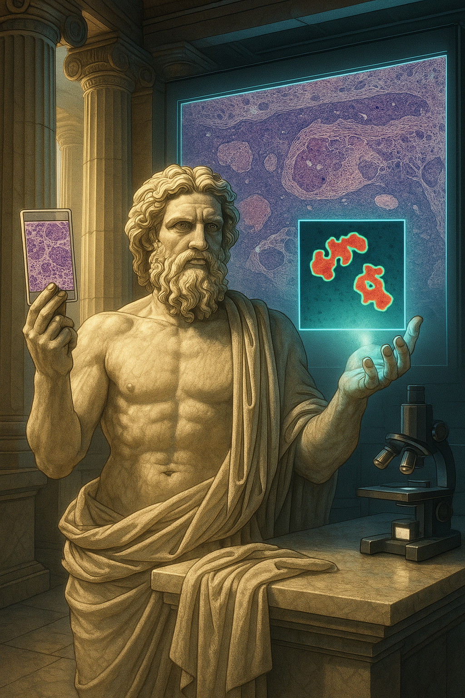

⚡️ZEUS: ZEro-shot visUal-language Segmentation pipeline for whole-slide images
===========

## What is ZEUS? 
  ZEUS is a fully automated, zero-shot segmentation pipeline for whole-slide histopathology images that leverages vision–language foundation models (VLMs). Currently, the framework includes support for three VLMs: [**CONCH**](https://github.com/mahmoodlab/CONCH/tree/main), [**KEEP**](https://github.com/MAGIC-AI4Med/KEEP/tree/main), and [**MUSK**](https://github.com/lilab-stanford/MUSK/tree/main). It consists of:<br/> 
  <ol>
    <li><strong>Tissue Detection &amp; Patching:</strong> Identify tissue regions on the WSI and split them into patches by implementing <a href="https://github.com/mahmoodlab/CLAM">CLAM</a> framework.</li>
    <li><strong>Prompt Ensembles</strong>: Craft rich textual descriptions for each class (e.g. tumor vs. healthy) without any manual annotations.</li>
    <li><strong>Vision Encoding</strong>: Extract high-level feature embeddings from WSI patches using a frozen, pre-trained vision encoder.</li>
    <li><strong>Multimodal Alignment</strong>: Compute cosine similarities between text and image embeddings to localize regions of interest.</li>
    <li><strong>Mask Reconstruction</strong>: Stack per-class similarity maps and apply a pixel-wise argmax to produce the final segmentation mask.</li>
  </ol>
  By combining textual prompts and patch-level features in a single inference pass, ZEUS delivers explainable, annotation-free tumor delineation across primary and metastatic skin lesions.
</p>

## ⚙️ **Installation**:
First clone the repo and cd into the directory:
```shell
git clone https://github.com/smoreno18/ZEUS.git
cd ZEUS
```
Then create a conda env and install the dependencies:
```shell
conda create -n zeus python=3.10.12 -y
conda activate zeus
pip install --upgrade pip
pip install -e .
pip install -r requirements.txt
```

## 🚀 **Lauching ZEUS**:
<ol>
  <li>
    <strong>First, download the model weights following the instructions from their respective repositories and place them inside <code>models/checkpoints</code>.</strong>
  </li>
  <li>
    <strong>Then, place your WSIs inside <code>data/images</code>.</strong> If you have annotations, put them in <code>data/masks</code>.
  </li>
  <li>
    <strong>Create your data-specific prompt template, which defines the textual descriptions for each class (e.g., tumor, normal tissue).</strong> You can find an example for skin cancer (Cutaneous Spindle Cell neoplasms) detection <a href="inference/local_data/prompts/Templates/example_template.json">here</a>.
  </li>
  <li>
    <strong>Once your prompt template is ready and your data is set up, you can execute the full pipeline using the following command:</strong>
  </li>
</ol>

      
```
python main.py --data ./data --save_dir ./output --template_name template1 --models model1,model2
```
- `--data`: Path to the directory containing your data.
- `--save/dir ./output`: Output directory where all processed results, tissue masks, coordinates, and embeddings will be saved.
- `--template_name`: Name of the textual prompt template (e.g., template1) to define the class descriptions for zero-shot inference.
- `--models model1,model2`: Comma-separated list of vision–language models to use for embedding extraction (e.g., CONCH, KEEP, MUSK).

> [!NOTE]
> By default, this command uses a patch size of 448×448 pixels with a 75% overlap. You can customize these patching settings directly in [main.py](main.py) if needed for your specific application.


### **Or if you are already familiar with WSI processing you can perform the pipeline steps individually:**

**Step 1: Tissue Detection &amp; Patching:** Segments tissue vs. background from a dir of WSIs and split the tissue regions into patches
 - **Command**:
   ```bash
   extract_patches_features.py --data ./data/images --save_dir ./output --seg --patch --patch_size 448 --step_size 112 --models model1,model2
   ```
   - `--data`: Path to the directory containing your WSIs.
   - `--save/dir ./output`: Output directory where all processed results, tissue masks, coordinates, and embeddings will be saved.
   - `--seg`: Enables tissue segmentation to exclude background before patch extraction.
   - `--patch`: Activates patching mode to tile the WSIs into smaller fixed-size patches.
   - `--patch_size 448`: Patch size in pixels (e.g., 448 = 448×448 pixels per patch).
   - `--step_size 112`: Step size or stride between patches; smaller values produce higher overlap and smoother boundaries (e.g., 112 = 75% overlap).
   - `--models model1,model2`: Comma-separated list of vision–language models to use for embedding extraction (e.g., CONCH, KEEP, MUSK).
 - **Outputs**:
   - `output/tissue/`: Binary masks (for each WSI) used to delimit segmentation to tissue regions.
   - `output/coords/`: .npy files storing patch coordinates for each WSI.
   - `output/embeddings/model1/`, `output/embeddings/model2/`: Feature embeddings per model, stored as .npy files.

 **Step 2: Inference:** Generates prompt ensembles, computes cosine similarities and generates the prediction masks.
 - **Command**:
   ```bash
   python process_embeddings.py --exp ./output --pred --tissue --template_name template1 --model model1
   ```
   - `--data`: Path to directory containing WSIs.
   - `--exp ./output`: Path to the directory containing previously saved patch features and metadata (e.g., the --save_dir from Step 1).
   - `--pred`: Enables prediction mode to generate segmentation maps.
   - `--tissue`: Applies tissue mask during segmentation.Saves soft similarity maps for both classes as PNGs.
   - `--sim_maps`: Saves soft similarity maps for both classes as PNGs.
   - `--template_name template1`: Name of the textual prompt template (e.g., template1) to define the class descriptions for zero-shot inference.
   - `--model model1`: Vision–language model used for inference; options include CONCH, KEEP, or MUSK.
 - **Outputs**:
   - `output/similarities/template1/model1`: Numpy files containing per WSI cosine similatiry scores for each patch.
   - `output/pred_masks/template1/model1`: Binary or probability masks for each WSI, showing predicted tumor regions.
   - `output/similarity_maps/template1/model1`: Per-class similarity maps (raw scores) saved as .npy or .png for further inspection or thresholding.

 **Step 3: Inference:** Generates prediction and ground truth (if available) overlays.
 - **Command**:
   ```bash
   python process_embeddings.py --data ./data --exp ./output --pred --tissue --template_name template1 --model model1
   ```
   - `--data`: Root directory of your dataset, including WSI images and ground truth masks.
   - `--exp`: Path to the experiment output folder containing model predictions, tissue masks, etc.
   - `--template_name`: Name of the textual prompt template used (e.g., example_template), used to locate model prediction folders.
   - `--models`: Comma-separated list of models to overlay (e.g., CONCH,KEEP).
   - `--resize_factor`(optional): Downsampling factor to control overlay size (default is 1).
 - **Output**:
   - `output/overlay_prediction`: Side-by-side visualization of GT vs model predictions with legend.
   

## 📊 **Evaluating Segmentation results**:

**To calculate the Dice Similarity Coefficient (DSC), as well as precision and recall, run**:
```
python eval_segmentation.py --data ./data --exp ./output --pred --tissue --template_name template1 --model model1
```
   - `--data`: Folder containing WSI images/ and GT masks/.
   - `--exp`: Path to the experiment output folder containing model predictions, tissue masks, etc.
   - `--template_name`: Name of the textual prompt template used (e.g., example_template), used to locate model prediction folders.
   - `--models`: Comma-separated list of models to overlay (e.g., CONCH,KEEP).
   - `--resize_factor`(optional): Downsampling factor to control overlay size (default is 1).
 - **Output**:
   - `output/overlay_prediction`: Side-by-side visualization of GT vs model predictions with legend.

